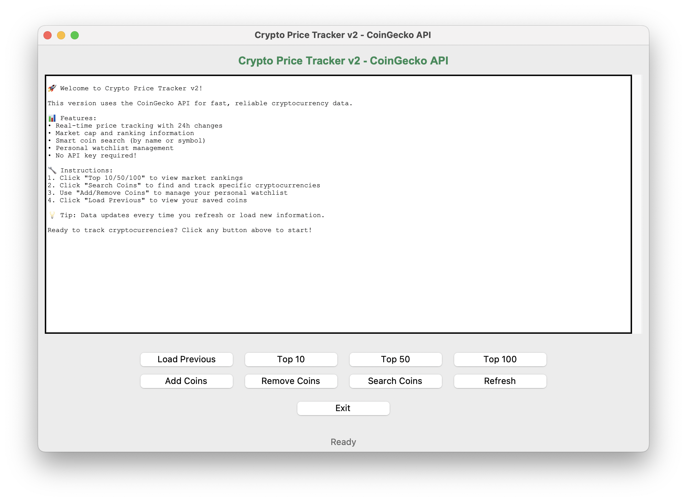
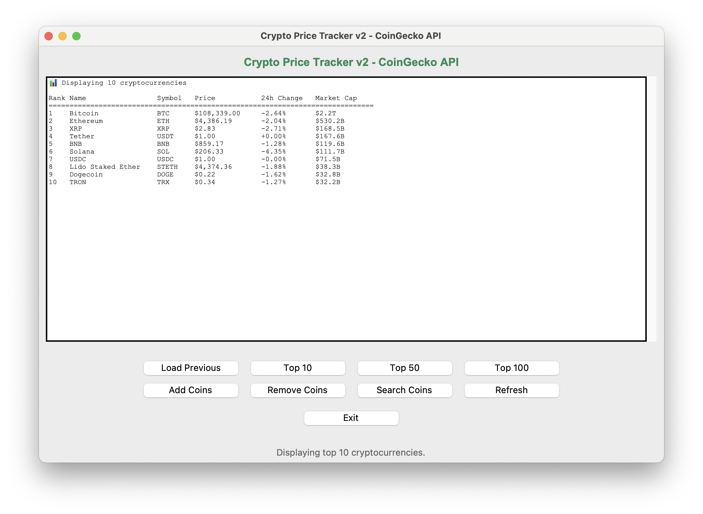
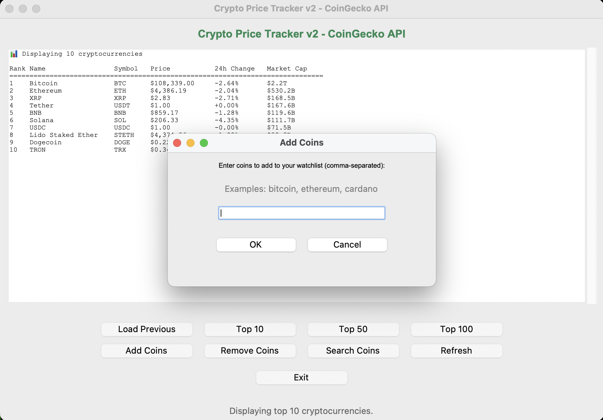

# 📈 Crypto Price Tracker

A Python-based cryptocurrency price tracking application with both web scraping and API-based versions.

## 🚀 Quick Start

Choose your preferred version:

- **v1 (Web Scraping)**: `python3 src/Crypto_Prices.py`
- **v2 (CoinGecko API)**: `python3 src/Crypto_Prices_v2.py`
- **GUI v1**: `python3 dashboard/Crypto_Prices_Interface_v1.py`
- **GUI v2** ⭐ **Recommended**: `python3 dashboard/Crypto_Prices_Interface_v2.py`

## 📋 Versions

### v1 - Web Scraping Version
Traditional approach using web scraping from CoinMarketCap and CoinRanking.

**Features:**
- Web scraping with BeautifulSoup
- Data from CoinMarketCap and CoinRanking
- Persistent storage in `coins.json`

**Pros:** No API limits  
**Cons:** Slower, fragile to website changes

### v2 - CoinGecko API Version ⭐ **Recommended**
Modern approach using the CoinGecko API for reliable data.

**Features:**
- CoinGecko API integration (no API key required)
- Rate limiting and error handling
- Enhanced data display with market cap and 24h changes
- Smart coin search (convert names/symbols to IDs)
- Separate data file `coins_v2.json`

**Pros:** Fast, reliable, rich data  
**Cons:** API rate limits (50 calls/minute)

### GUI v2 - Modern Interface ⭐ **Recommended**
Combines the CoinGecko API with an enhanced graphical interface.

**Features:**
- Modern, responsive GUI with professional styling
- Centered dialog boxes for better user experience
- Perfect column alignment in data tables
- Real-time price updates with 24h changes
- Enhanced error handling and user feedback
- Smooth integration with v2 API functionality

**Pros:** Best user experience, reliable data, modern design  
**Cons:** Requires GUI environment

## 📊 Features

### Core Functionality
- **Real-time Price Tracking**: Get current prices for any cryptocurrency
- **Top Rankings**: View top 10, 50, or 100 cryptocurrencies by market cap
- **Personal Watchlist**: Save, add, or remove coins from your tracking list
- **Persistent Storage**: Your coin selections are saved between sessions
- **Multiple Interfaces**: CLI and GUI options available

### v2 Enhanced Features
- **Market Data**: Price, market cap, 24-hour change percentage
- **Smart Search**: Find coins by name or symbol
- **Better Formatting**: Clean, organized data presentation
- **Error Recovery**: Robust handling of API failures and rate limits

## ⚙️ Installation

### Prerequisites
```bash
Python 3.6 or higher
```

### Dependencies

**For v1 (Web Scraping):**
```bash
pip install requests beautifulsoup4
```

**For v2 (API Version):**
```bash
pip install requests
```

**For GUI Version:**
```bash
pip install requests beautifulsoup4 tkinter
```

## 🖥️ Usage Examples

### Command Line Interface
```bash
# Run v2 (recommended)
python3 src/Crypto_Prices_v2.py

# Or run v1
python3 src/Crypto_Prices.py
```

### GUI Interface
```bash
# GUI v2 (recommended) - CoinGecko API with modern interface
python3 dashboard/Crypto_Prices_Interface_v2.py

# GUI v1 - Web scraping version
python3 dashboard/Crypto_Prices_Interface_v1.py
```

### Sample Output (v2)
```
Rank   Name                 Symbol   Price           24h Change   Market Cap     
-------------------------------------------------------------------------------------
1      Bitcoin              BTC      $108,354.00     -2.59%       $2.2T        
2      Ethereum             ETH      $4,395.84       +1.75%       $530.7B        
3      XRP                  XRP      $2.83           +2.81%       $168.3B        
```

## 📸 Screenshots

The application features both command-line and graphical user interfaces:

### GUI v2 Interface (Recommended)

#### Welcome Screen
The modern interface greets users with a comprehensive feature overview and clear instructions.



#### Top Cryptocurrencies Display
View real-time data for top cryptocurrencies with perfect column alignment, showing rank, price, 24h changes, and market cap.



#### Personal Watchlist
Manage your personal cryptocurrency watchlist with clean formatting and real-time price updates.



**Features shown in screenshots:**
- 🏠 Welcome screen with feature overview and instructions
- 📊 Top cryptocurrencies display with professional table formatting
- 💰 Personal watchlist management with price tracking
- 🔍 Smart coin search functionality (accessible via buttons)
- 📱 Responsive, user-friendly interface with centered dialogs

## 📁 Project Structure

```
crypto_tracker_git/
├── src/
│   ├── Crypto_Prices.py      # v1 - Web scraping version
│   └── Crypto_Prices_v2.py   # v2 - CoinGecko API version
├── dashboard/
│   ├── Crypto_Prices_Interface_v1.py  # GUI v1 - Web scraping
│   └── Crypto_Prices_Interface_v2.py  # GUI v2 - CoinGecko API (recommended)
├── screenshots/              # Application screenshots
├── coins.json                # v1 saved coins
├── coins_v2.json            # v2 saved coins
├── README.md
└── LICENSE
```

## 🔧 Configuration

### v1 Configuration
Uses web scraping with built-in delays and error handling.

### v2 Configuration
- **Rate Limiting**: 1.2 seconds between API calls
- **Free Tier**: 10,000-30,000 requests/month
- **No API Key Required**: Uses CoinGecko's free public API

## 🛡️ Error Handling

Both versions include comprehensive error handling:
- Network connectivity issues
- API rate limiting (v2)
- Invalid coin names/symbols
- Data parsing errors
- File I/O operations

## 🤝 Contributing

1. Fork the repository
2. Create a feature branch
3. Make your changes
4. Test both v1 and v2 versions
5. Submit a pull request

## 📜 License

This project is licensed under the MIT License - see the [LICENSE](LICENSE) file for details.

## 🙏 Acknowledgments

- **v1**: Data from CoinMarketCap and CoinRanking websites
- **v2**: Powered by [CoinGecko API](https://www.coingecko.com/en/api)
- The interface was created using AI, with my prompts and source code as reference
- Built with Python and love ❤️


